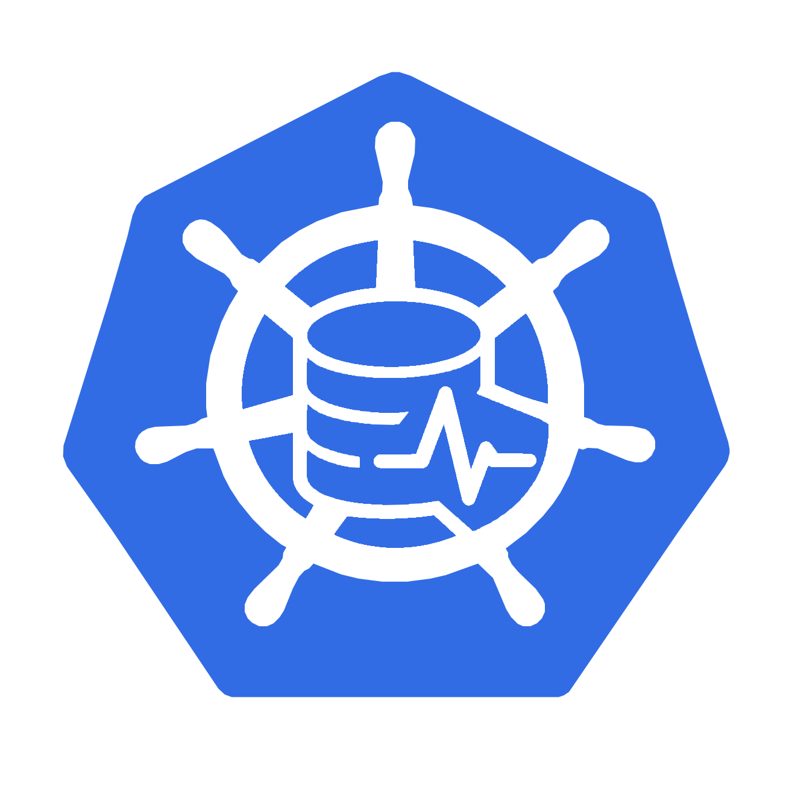

# Kubernetes Node Disk Health & Telemetry Operator

  

A Kubernetes-native DaemonSet that discovers physical disks on every node,
publishes their health and telemetry in cluster-scoped `PhysicalDisk` resources,
and exports disk metrics to Prometheus.
